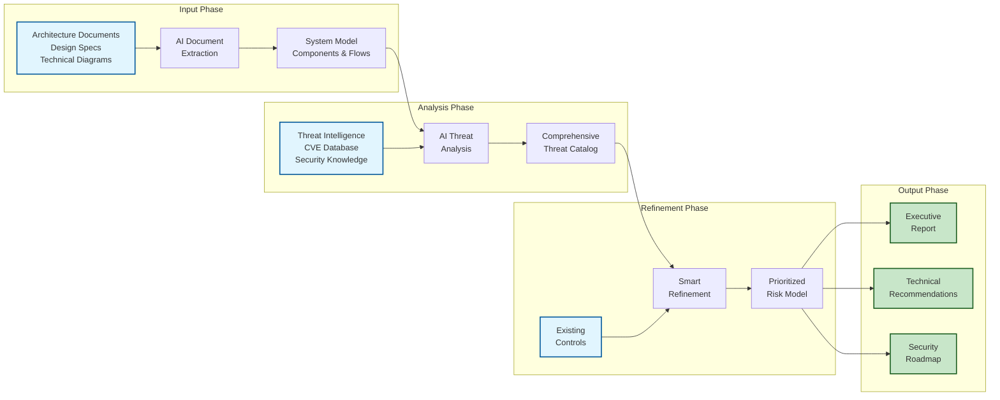

```mermaid:disable-run
graph LR
    subgraph "Input Phase"
        DOCS[Architecture Documents<br/>Design Specs<br/>Technical Diagrams]
        DOCS --> EXTRACT[AI Document<br/>Extraction]
        EXTRACT --> DFD[System Model<br/>Components & Flows]
    end
    
    subgraph "Analysis Phase"
        DFD --> ANALYZE[AI Threat<br/>Analysis]
        INTEL[Threat Intelligence<br/>CVE Database<br/>Security Knowledge] --> ANALYZE
        ANALYZE --> THREATS[Comprehensive<br/>Threat Catalog]
    end
    
    subgraph "Refinement Phase"
        THREATS --> REFINE[Smart<br/>Refinement]
        CONTROLS[Existing<br/>Controls] --> REFINE
        REFINE --> PRIORITIZED[Prioritized<br/>Risk Model]
    end
    
    subgraph "Output Phase"
        PRIORITIZED --> REPORT[Executive<br/>Report]
        PRIORITIZED --> TECH[Technical<br/>Recommendations]
        PRIORITIZED --> ROADMAP[Security<br/>Roadmap]
    end
    
    style DOCS fill:#e1f5fe,stroke:#01579b,stroke-width:2px
    style INTEL fill:#e1f5fe,stroke:#01579b,stroke-width:2px
    style CONTROLS fill:#e1f5fe,stroke:#01579b,stroke-width:2px
    style REPORT fill:#c8e6c9,stroke:#1b5e20,stroke-width:2px
    style TECH fill:#c8e6c9,stroke:#1b5e20,stroke-width:2px
    style ROADMAP fill:#c8e6c9,stroke:#1b5e20,stroke-width:2px
```