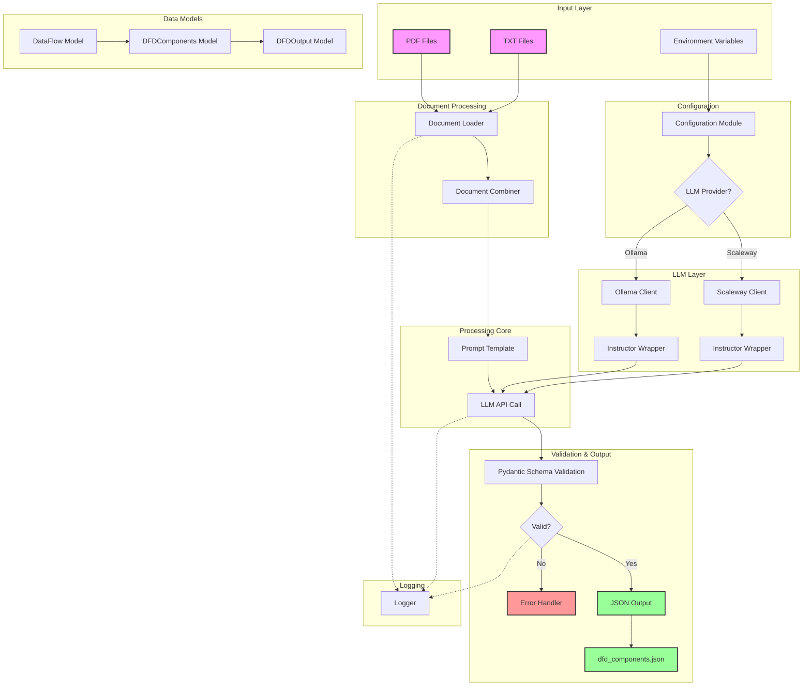

```mermaid:disable-run
graph TB
    subgraph "Input Layer"
        PDF[PDF Files]
        TXT[TXT Files]
        ENV[Environment Variables]
    end
    
    subgraph "Configuration"
        CONFIG[Configuration Module]
        ENV --> CONFIG
        CONFIG --> PROVIDER{LLM Provider?}
    end
    
    subgraph "Document Processing"
        LOADER[Document Loader]
        PDF --> LOADER
        TXT --> LOADER
        LOADER --> COMBINER[Document Combiner]
    end
    
    subgraph "LLM Layer"
        PROVIDER -->|Scaleway| SCW[Scaleway Client]
        PROVIDER -->|Ollama| OLL[Ollama Client]
        SCW --> INSTRUCTOR1[Instructor Wrapper]
        OLL --> INSTRUCTOR2[Instructor Wrapper]
    end
    
    subgraph "Processing Core"
        PROMPT[Prompt Template]
        COMBINER --> PROMPT
        PROMPT --> LLM_CALL[LLM API Call]
        INSTRUCTOR1 --> LLM_CALL
        INSTRUCTOR2 --> LLM_CALL
    end
    
    subgraph "Validation & Output"
        LLM_CALL --> SCHEMA[Pydantic Schema Validation]
        SCHEMA --> VALIDATOR{Valid?}
        VALIDATOR -->|Yes| JSON[JSON Output]
        VALIDATOR -->|No| ERROR[Error Handler]
        JSON --> FILE[dfd_components.json]
    end
    
    subgraph "Data Models"
        DF[DataFlow Model]
        DFD[DFDComponents Model]
        OUT[DFDOutput Model]
        DF --> DFD
        DFD --> OUT
    end
    
    subgraph "Logging"
        LOGGER[Logger]
        LLM_CALL -.-> LOGGER
        VALIDATOR -.-> LOGGER
        LOADER -.-> LOGGER
    end
    
    style PDF fill:#f9f,stroke:#333,stroke-width:2px
    style TXT fill:#f9f,stroke:#333,stroke-width:2px
    style JSON fill:#9f9,stroke:#333,stroke-width:2px
    style FILE fill:#9f9,stroke:#333,stroke-width:2px
    style ERROR fill:#f99,stroke:#333,stroke-width:2px
```