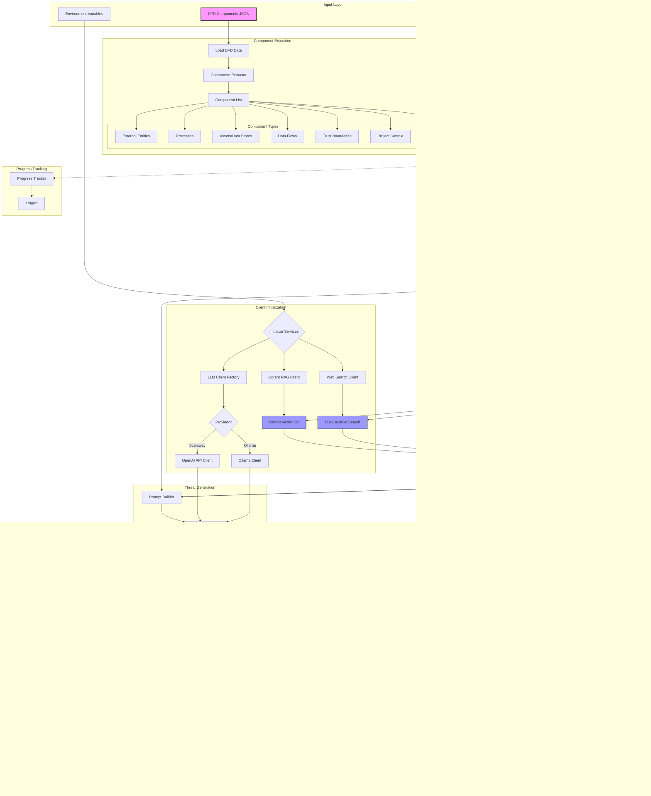

```mermaid:disable-run
graph TB
    subgraph "Input Layer"
        DFD[DFD Components JSON]
        STRIDE_CFG[STRIDE Config]
        ENV2[Environment Variables]
    end
    
    subgraph "Client Initialization"
        ENV2 --> INIT{Initialize Services}
        INIT --> LLM_INIT[LLM Client Factory]
        INIT --> RAG_INIT[Qdrant RAG Client]
        INIT --> WEB_INIT[Web Search Client]
        
        LLM_INIT --> PROVIDER_CHECK{Provider?}
        PROVIDER_CHECK -->|Scaleway| SCW_CLIENT[OpenAI API Client]
        PROVIDER_CHECK -->|Ollama| OLLAMA_CLIENT[Ollama Client]
        
        RAG_INIT --> QDRANT[Qdrant Vector DB]
        WEB_INIT --> DDGS[DuckDuckGo Search]
    end
    
    subgraph "Component Extraction"
        DFD --> LOADER2[Load DFD Data]
        LOADER2 --> EXTRACTOR[Component Extractor]
        EXTRACTOR --> COMPONENTS[Component List]
        
        subgraph "Component Types"
            EXT_ENT[External Entities]
            PROC[Processes]
            ASSETS[Assets/Data Stores]
            FLOWS[Data Flows]
            BOUNDS[Trust Boundaries]
            PROJ[Project Context]
        end
        
        COMPONENTS --> EXT_ENT
        COMPONENTS --> PROC
        COMPONENTS --> ASSETS
        COMPONENTS --> FLOWS
        COMPONENTS --> BOUNDS
        COMPONENTS --> PROJ
    end
    
    subgraph "Parallel Analysis Engine"
        COMPONENTS --> THREAD_POOL[ThreadPoolExecutor]
        THREAD_POOL --> WORKER1[Worker 1]
        THREAD_POOL --> WORKER2[Worker 2]
        THREAD_POOL --> WORKER3[Worker N]
        
        WORKER1 --> ANALYZER[Threat Analyzer]
        WORKER2 --> ANALYZER
        WORKER3 --> ANALYZER
        
        ANALYZER --> STRIDE_LOOP{For Each STRIDE Category}
        STRIDE_CFG --> STRIDE_LOOP
    end
    
    subgraph "Context Enrichment"
        STRIDE_LOOP --> RAG_SEARCH[RAG Search]
        STRIDE_LOOP --> WEB_SEARCH[Web Search]
        
        RAG_SEARCH --> QDRANT
        QDRANT --> RAG_CTX[Historical Context]
        
        WEB_SEARCH --> CACHE{Cache?}
        CACHE -->|Hit| CACHED[Cached Results]
        CACHE -->|Miss| DDGS
        DDGS --> WEB_CTX[Current Context]
        WEB_CTX --> CACHE_STORE[Store in Cache]
    end
    
    subgraph "Threat Generation"
        RAG_CTX --> PROMPT_BUILD[Prompt Builder]
        WEB_CTX --> PROMPT_BUILD
        STRIDE_LOOP --> PROMPT_BUILD
        
        PROMPT_BUILD --> LLM_GEN[LLM Generation]
        SCW_CLIENT --> LLM_GEN
        OLLAMA_CLIENT --> LLM_GEN
        
        LLM_GEN --> JSON_PARSE[JSON Parser]
        JSON_PARSE --> THREAT_OBJ[Threat Objects]
    end
    
    subgraph "Post-Processing"
        THREAT_OBJ --> RISK_CALC[Risk Calculator]
        RISK_CALC --> DEDUP[Deduplication]
        DEDUP --> SORT[Sort by Risk]
        SORT --> THREATS_LIST[Final Threats List]
    end
    
    subgraph "Output Generation"
        THREATS_LIST --> OUTPUT_BUILD[Output Builder]
        OUTPUT_BUILD --> VALIDATE[Pydantic Validation]
        VALIDATE --> JSON_OUT[identified_threats.json]
        VALIDATE --> SUMMARY[Summary Report]
    end
    
    subgraph "Progress Tracking"
        THREAD_POOL -.-> PROGRESS[Progress Tracker]
        PROGRESS -.-> LOG[Logger]
    end
    
    style DFD fill:#f9f,stroke:#333,stroke-width:2px
    style JSON_OUT fill:#9f9,stroke:#333,stroke-width:2px
    style SUMMARY fill:#9f9,stroke:#333,stroke-width:2px
    style QDRANT fill:#99f,stroke:#333,stroke-width:2px
    style DDGS fill:#99f,stroke:#333,stroke-width:2px
```