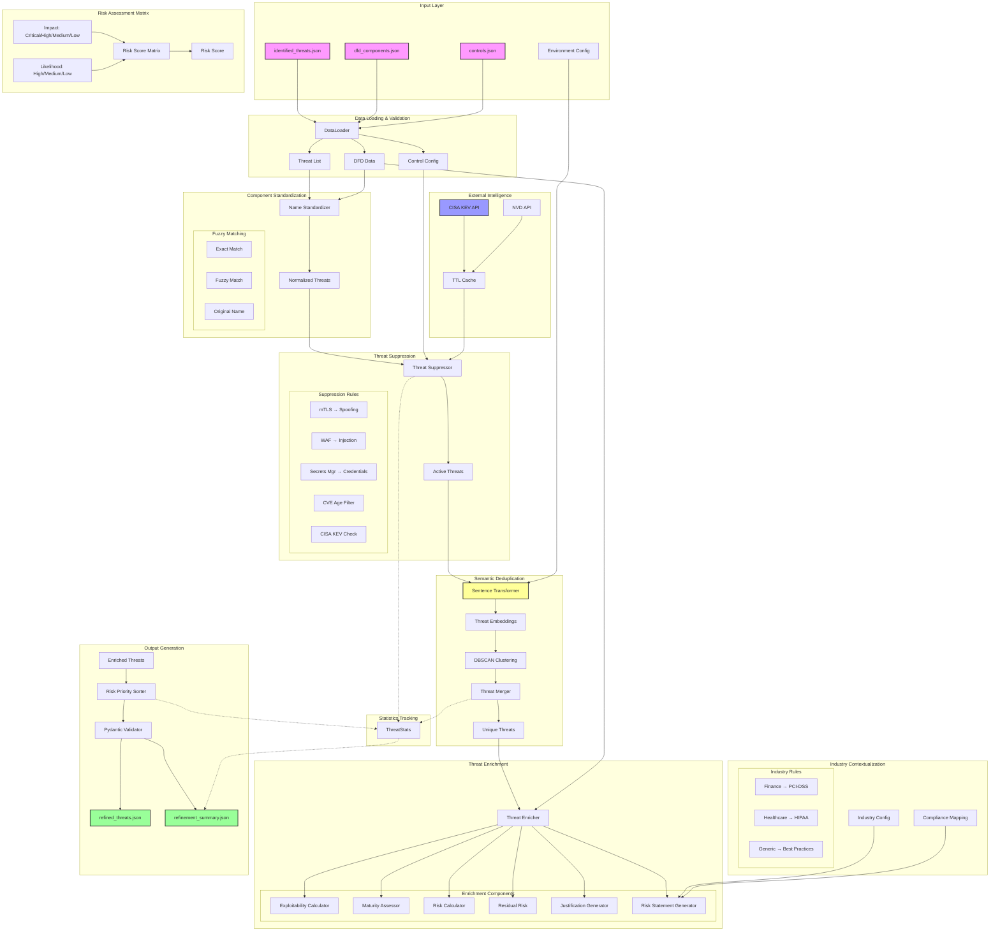

```mermaid:disable-run
graph TB
    subgraph "Input Layer"
        THREATS[identified_threats.json]
        DFD2[dfd_components.json]
        CONTROLS[controls.json]
        ENV3[Environment Config]
    end
    
    subgraph "External Intelligence"
        CISA[CISA KEV API]
        NVD[NVD API]
        CACHE[TTL Cache]
        
        CISA --> CACHE
        NVD --> CACHE
    end
    
    subgraph "Data Loading & Validation"
        LOADER3[DataLoader]
        THREATS --> LOADER3
        DFD2 --> LOADER3
        CONTROLS --> LOADER3
        
        LOADER3 --> THREAT_LIST[Threat List]
        LOADER3 --> DFD_DATA[DFD Data]
        LOADER3 --> CONTROL_CONFIG[Control Config]
    end
    
    subgraph "Component Standardization"
        THREAT_LIST --> STANDARDIZER[Name Standardizer]
        DFD_DATA --> STANDARDIZER
        STANDARDIZER --> NORMALIZED[Normalized Threats]
        
        subgraph "Fuzzy Matching"
            EXACT[Exact Match]
            FUZZY[Fuzzy Match]
            FALLBACK[Original Name]
        end
    end
    
    subgraph "Threat Suppression"
        NORMALIZED --> SUPPRESSOR[Threat Suppressor]
        CONTROL_CONFIG --> SUPPRESSOR
        CACHE --> SUPPRESSOR
        
        subgraph "Suppression Rules"
            MTLS_CHECK[mTLS → Spoofing]
            WAF_CHECK[WAF → Injection]
            SECRETS_CHECK[Secrets Mgr → Credentials]
            CVE_AGE[CVE Age Filter]
            KEV_CHECK[CISA KEV Check]
        end
        
        SUPPRESSOR --> ACTIVE_THREATS[Active Threats]
    end
    
    subgraph "Semantic Deduplication"
        ACTIVE_THREATS --> EMBEDDER[Sentence Transformer]
        ENV3 --> EMBEDDER
        
        EMBEDDER --> VECTORS[Threat Embeddings]
        VECTORS --> DBSCAN_CLUSTER[DBSCAN Clustering]
        
        DBSCAN_CLUSTER --> MERGER[Threat Merger]
        MERGER --> UNIQUE_THREATS[Unique Threats]
    end
    
    subgraph "Threat Enrichment"
        UNIQUE_THREATS --> ENRICHER[Threat Enricher]
        DFD_DATA --> ENRICHER
        
        subgraph "Enrichment Components"
            EXPLOIT_CALC[Exploitability Calculator]
            MATURITY_CALC[Maturity Assessor]
            RISK_CALC[Risk Calculator]
            RESIDUAL_CALC[Residual Risk]
            JUSTIFY_GEN[Justification Generator]
            STMT_GEN[Risk Statement Generator]
        end
        
        ENRICHER --> EXPLOIT_CALC
        ENRICHER --> MATURITY_CALC
        ENRICHER --> RISK_CALC
        ENRICHER --> RESIDUAL_CALC
        ENRICHER --> JUSTIFY_GEN
        ENRICHER --> STMT_GEN
    end
    
    subgraph "Risk Assessment Matrix"
        IMPACT_LEVEL[Impact: Critical/High/Medium/Low]
        LIKELIHOOD_LEVEL[Likelihood: High/Medium/Low]
        RISK_MATRIX[Risk Score Matrix]
        
        IMPACT_LEVEL --> RISK_MATRIX
        LIKELIHOOD_LEVEL --> RISK_MATRIX
        RISK_MATRIX --> RISK_SCORE[Risk Score]
    end
    
    subgraph "Industry Contextualization"
        INDUSTRY_CFG[Industry Config]
        COMPLIANCE[Compliance Mapping]
        
        INDUSTRY_CFG --> STMT_GEN
        COMPLIANCE --> STMT_GEN
        
        subgraph "Industry Rules"
            FINANCE_RULES[Finance → PCI-DSS]
            HEALTH_RULES[Healthcare → HIPAA]
            GENERIC_RULES[Generic → Best Practices]
        end
    end
    
    subgraph "Output Generation"
        ENRICHED[Enriched Threats]
        ENRICHED --> SORTER[Risk Priority Sorter]
        SORTER --> VALIDATOR2[Pydantic Validator]
        VALIDATOR2 --> FINAL_OUTPUT[refined_threats.json]
        VALIDATOR2 --> SUMMARY[refinement_summary.json]
    end
    
    subgraph "Statistics Tracking"
        STATS[ThreatStats]
        SUPPRESSOR -.-> STATS
        MERGER -.-> STATS
        SORTER -.-> STATS
        STATS -.-> SUMMARY
    end
    
    style THREATS fill:#f9f,stroke:#333,stroke-width:2px
    style DFD2 fill:#f9f,stroke:#333,stroke-width:2px
    style CONTROLS fill:#f9f,stroke:#333,stroke-width:2px
    style FINAL_OUTPUT fill:#9f9,stroke:#333,stroke-width:2px
    style SUMMARY fill:#9f9,stroke:#333,stroke-width:2px
    style CISA fill:#99f,stroke:#333,stroke-width:2px
    style EMBEDDER fill:#ff9,stroke:#333,stroke-width:2px
```